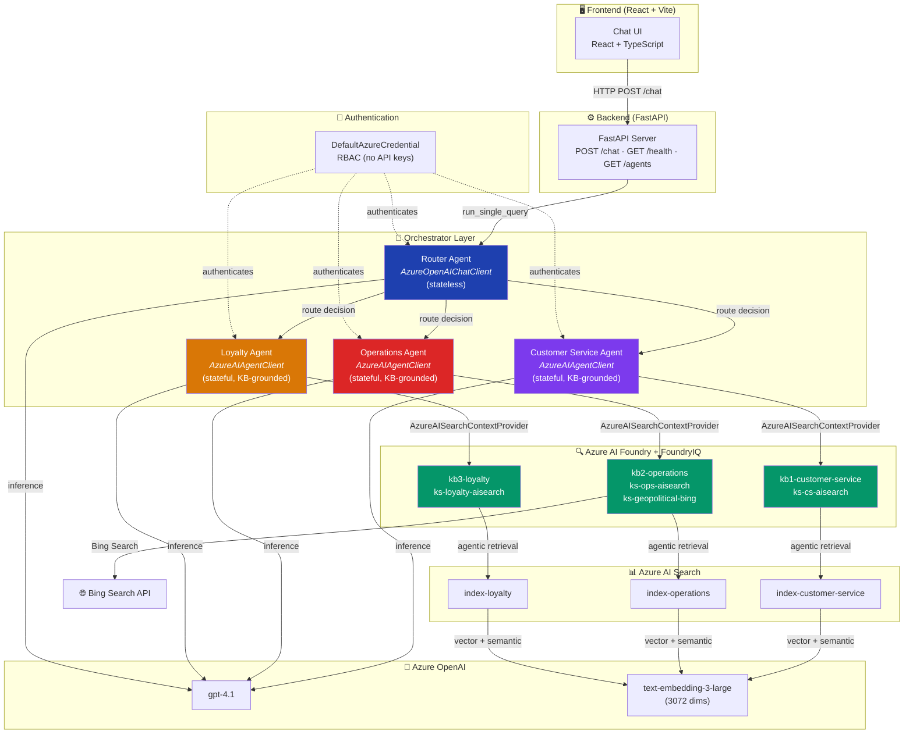
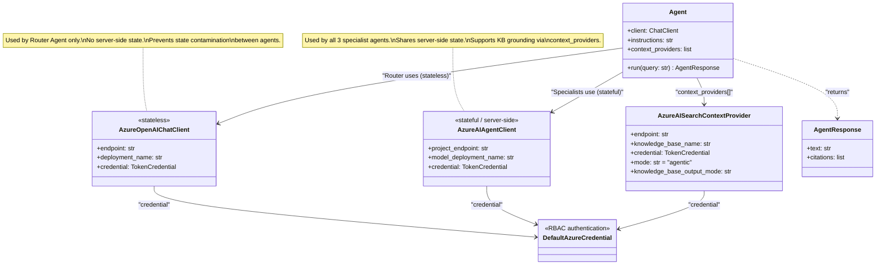
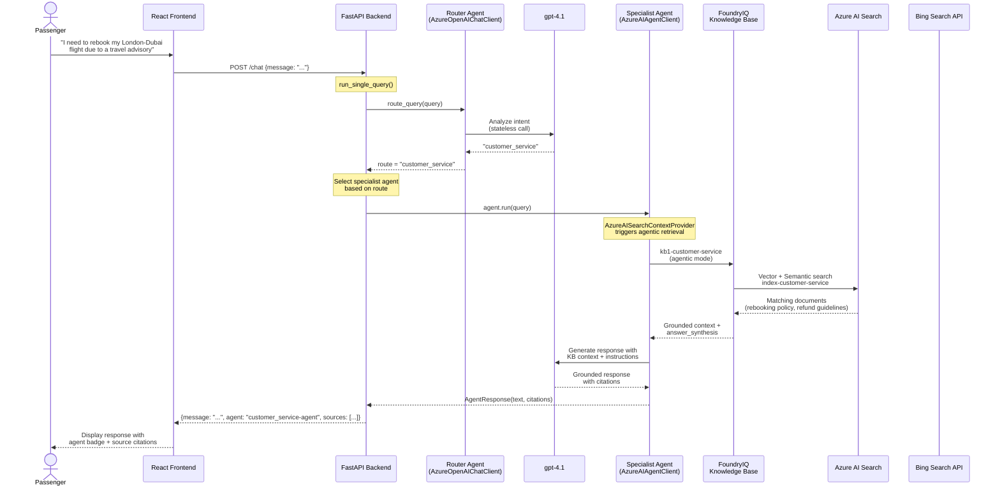
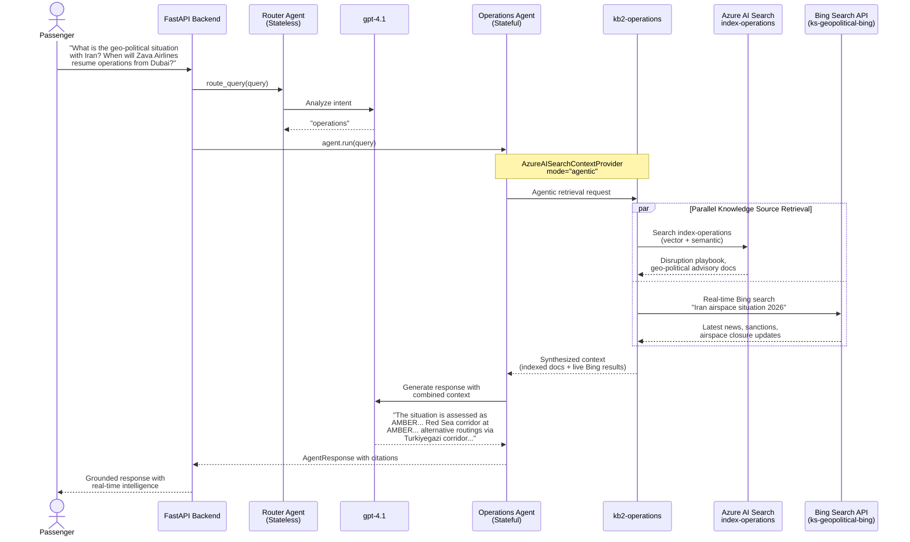
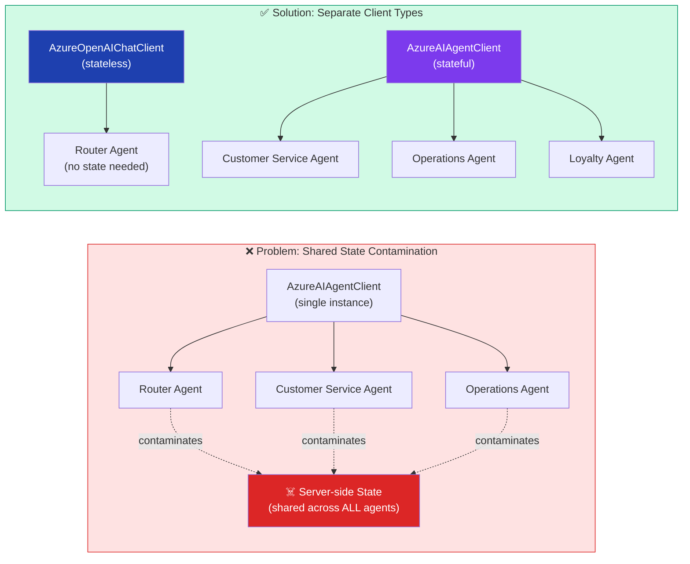
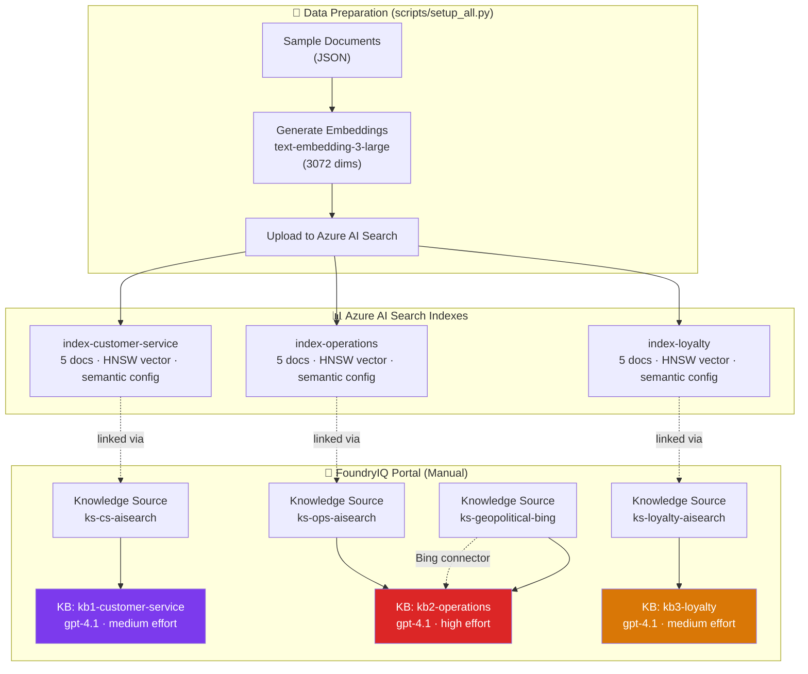
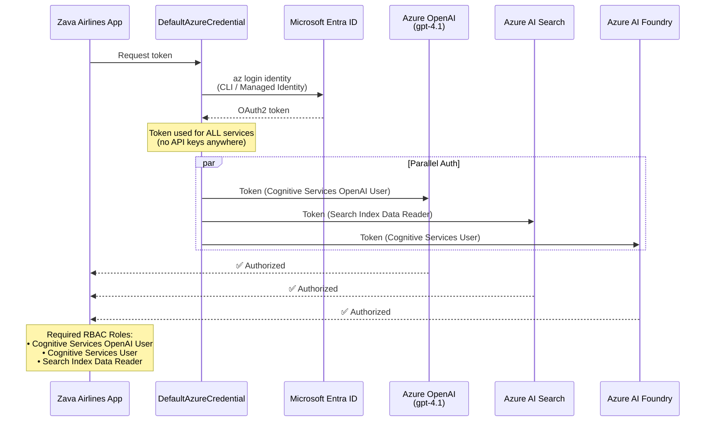
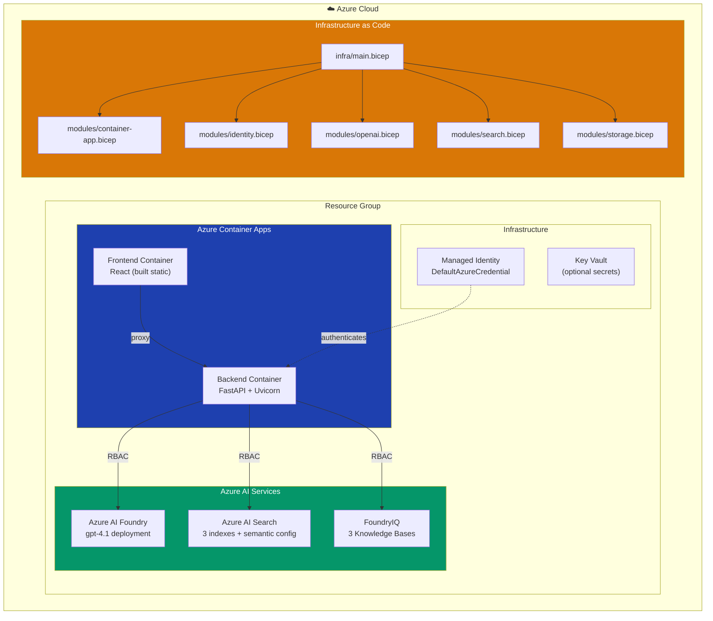

# Zava Airlines — Architecture & Sequence Diagrams

## 1. High-Level System Architecture

---

## 2. Agent Framework SDK — Class Relationship

---

## 3. Query Routing — Sequence Diagram

Shows the complete flow from user input to grounded response.

---

## 4. Geo-Political Query — Sequence Diagram (Operations Agent + Bing Search)

---

## 5. Stateless Router vs Stateful Specialists — Why It Matters

---

## 6. Data Flow — Index Creation & Knowledge Base Setup

---

## 7. Authentication & RBAC Flow

---

## 8. Deployment Architecture (Azure Container Apps)

